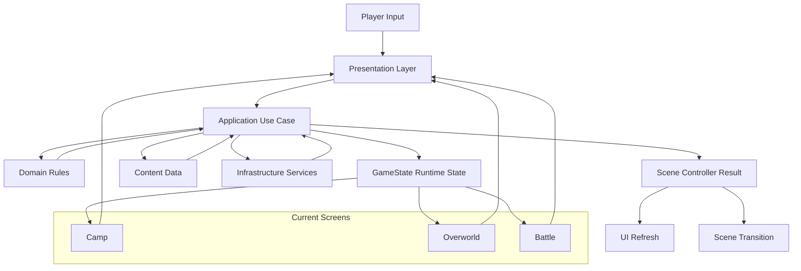
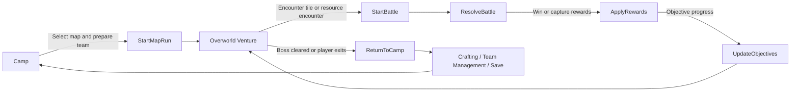

# Architecture

## Core (well known architecture design)

This project should use a small-team version of **Clean Architecture with a data-driven gameplay core**. For Godot and for the current repository size, that is the most practical target: strict enough to stop chaos, but not so heavy that it slows down delivery.

If I analyze the current project, it is already close to this shape:

- `scripts/game_data.gd` is the static content catalog and rule source.
- `scripts/game_state.gd` is the runtime state holder and progression state.
- `scripts/map_run_service.gd` is an application service that prepares one overworld run.
- `scripts/overworld.gd`, `scripts/battle.gd`, and `scripts/camp.gd` are scene controllers.
- `scripts/ui/*.gd` and `scripts/ui/world_ui.gd` are presentation helpers and widgets.

The desired target architecture is:

- **Presentation layer**: scenes, UI widgets, input handling, visual feedback, scene-local controller scripts.
- **Application layer**: orchestration of use cases such as starting a venture, spawning a run, entering battle, resolving rewards, crafting, objective progression, and save/load commands.
- **Domain layer**: pure gameplay rules and invariant checks for creatures, items, objectives, rewards, battle formulas, progression, and map rules.
- **Data/content layer**: authored game definitions for maps, creatures, abilities, drops, recipes, encounter pools, and objective sets.
- **Infrastructure layer**: save files, scene loading, random source, resource loading, debug tools, analytics hooks, and external integrations if they appear later.

Mandatory boundaries:

- `GameData` must not become a dumping ground for runtime mutations.
- `GameState` must not own scene nodes, UI nodes, or layout logic.
- Scene controllers must not embed core formulas, drop tables, or long progression rules.
- UI scripts must not change progression state directly; they call application actions.
- Random generation must be routed through explicit services/helpers, not hidden inside unrelated UI code.

Recommended module split for the next iteration:

- `domain/`: battle math, objective rules, reward rules, item rules, creature progression rules.
- `application/`: venture flow, battle flow, reward resolution, collection management, crafting flow, save flow.
- `content/`: authored dictionaries or resources extracted from `GameData`.
- `presentation/`: scene scripts and UI scripts.
- `infrastructure/`: persistence, RNG abstraction, scene navigation, resource adapters.

What is already good and should be preserved:

- The project is strongly data-driven.
- The gameplay loop is clear: `Camp -> Overworld -> Battle -> Camp`.
- The map run generation already has its own service.
- UI styling already has a dedicated helper instead of ad hoc per-screen colors.

What should change next:

- Move battle formulas and reward resolution out of `battle.gd` and into domain/application modules.
- Move authored content out of one large `GameData` file into smaller content files grouped by concern.
- Introduce explicit use-case functions such as `StartMapRun`, `ResolveBattleRound`, `CraftItem`, `CompleteObjective`, `SaveProfile`.
- Treat scene scripts as adapters around those use cases, not as the place where business rules live.

## Data flow mermaid diagram



For the current game loop, the canonical runtime flow should be:



## Examples for your language or pseudocode

### Example: scene controller calling a use case

```gdscript
func _on_player_stepped() -> void:
	if not is_on_encounter_tile(player.global_position):
		return

	var result := VentureFlow.try_start_random_battle(
		GameState.current_map_id,
		player.global_position
	)
	if result.get("started", false):
		SceneRouter.go_to_battle(result)
```

### Example: application service

```gdscript
class_name VentureFlow
extends RefCounted

static func try_start_random_battle(map_id: String, world_pos: Vector2) -> Dictionary:
	var encounter_tag := EncounterResolver.resolve_tag(map_id, world_pos)
	var creature_id := ContentMaps.pick_wild_for_map(map_id, encounter_tag)
	if creature_id.is_empty():
		return {"started": false}

	GameState.set_pending_battle(creature_id, {
		"encounter_type": "wild",
		"encounter_tag": encounter_tag,
	})
	return {"started": true, "wild_id": creature_id}
```

### Example: domain rule

```gdscript
class_name BattleMath
extends RefCounted

static func calculate_damage(atk: float, defense: float, power: float) -> int:
	var reduction := defense / (defense + 25.0)
	return max(1, int(round((power + atk) * (1.0 - reduction))))
```

### Example: content split

```text
content/
  creatures.gd
  abilities.gd
  items.gd
  maps/
    verdant_wilds.gd
    ember_caves.gd
```

### Example: hard rule for controllers

```text
Controller may:
- read input
- call one use case
- update scene

Controller may not:
- invent reward tables
- calculate progression formulas
- mutate unrelated global state
- duplicate domain logic from another screen
```

## Review guidelines

These review rules should be enforced **strictly**. A change that violates them should be rejected, not "cleaned up later".

Architecture review checklist:

- Reject if UI code contains battle formulas, reward formulas, crafting formulas, or objective completion logic.
- Reject if scene scripts directly mutate multiple unrelated parts of `GameState` without going through a named use case.
- Reject if new gameplay content is hardcoded inside a controller instead of authored in content definitions.
- Reject if the same rule exists in two places, even if both versions currently match.
- Reject if a feature requires reading the whole project to understand one gameplay action.
- Reject if a new file mixes presentation, application orchestration, and domain rules in one class.
- Reject if a helper called "manager", "utils", or "helper" has no sharp responsibility.
- Reject if a change adds new runtime state into `GameData`.
- Reject if a change couples one screen to another screen's internal nodes or widget structure.
- Reject if save/load format changes without versioning or migration notes.

Code review standards for this repository:

- Every gameplay mutation must have one obvious owner.
- Every content table must have one obvious source of truth.
- Every random roll that affects balance must be auditable from authored data.
- Every scene transition must have an explicit input contract.
- Every battle rule must be testable without loading a full scene.
- Every objective rule must be deterministic from state plus event payload.
- Every new system must specify whether it belongs to domain, application, presentation, content, or infrastructure.

Practical merge criteria:

- If the feature can be implemented without touching UI, its core logic belongs outside UI.
- If two maps use the same mechanic, the mechanic must be shared and the numbers must be data.
- If a change adds only data, review should not require logic edits in three different layers.
- If a reviewer cannot point to the invariant owner in under one minute, the architecture is too blurry.

