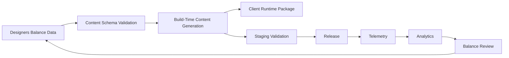

# Big Project Architecture

## Core (well known architecture design)

If this game became a genuinely large production with many developers, many maps, huge live balance tables, large databases, analytics, live-ops content, and long-term support, the architecture should evolve from small-team Clean Architecture into **Domain-Driven Design with bounded contexts, content pipelines, and service boundaries**.

The important difference is not "more folders". The important difference is **ownership and scaling safety**.

Target macro-structure for a big project:

- **Game Client Presentation**: Godot scenes, HUD, input, VFX, local UX.
- **Client Application Layer**: use-case orchestration, session flow, inventory commands, battle commands, map-session commands.
- **Shared Domain Modules**: combat domain, progression domain, economy domain, collection domain, quest/objective domain.
- **Content Pipeline**: validated authored data, balancing spreadsheets export, schema validation, generated resources, localization assets.
- **Platform/Backend Services**: accounts, cloud save, telemetry, matchmaking if needed, economy config delivery, event flags, anti-cheat relevant services.
- **Data Platform**: operational databases, analytics warehouse, dashboards, experiment platform, retention reports.

In a large project, `GameData` as one file is no longer acceptable. It must become:

- versioned schemas
- validated content packages
- generated runtime assets
- per-domain ownership
- CI validation gates

In a large project, `GameState` as one global runtime bag is also no longer acceptable. It must be split into focused state models:

- session state
- party state
- inventory state
- progression state
- objective state
- map run state
- battle state
- meta profile state

Required bounded contexts:

- **Combat**
- **Collection**
- **Economy and Crafting**
- **Map Exploration**
- **Objectives and Progression**
- **Meta/Profile**
- **LiveOps and Analytics**

Required engineering additions that are unnecessary in the current project but mandatory in a huge one:

- schema validation for every content file
- backward-compatible save migrations
- deterministic simulation boundaries
- authoritative IDs and naming conventions
- structured event bus or command/event contracts
- feature flags
- telemetry contracts
- balance patch workflow
- ownership map by team

## Data flow mermaid diagram

```mermaid
flowchart TD
    A[Player Client] --> B[Presentation]
    B --> C[Client Application Layer]
    C --> D[Client Domain Modules]
    C --> E[Local Session State]
    C --> F[Content Runtime Package]
    C --> G[Platform APIs]

    G --> H[Cloud Save Service]
    G --> I[Economy or Config Service]
    G --> J[Telemetry Service]

    J --> K[Analytics Warehouse]
    I --> F
    H --> E
    D --> C
    F --> C
    E --> B
```



For a live large-scale content workflow:



## Examples for your language or pseudocode

### Example: command boundary

```gdscript
class_name CraftItemCommand
extends RefCounted

var profile_id: String
var item_id: String
var amount: int
var request_id: String
```

### Example: application service with repository boundary

```gdscript
class_name CraftingApplicationService
extends RefCounted

func craft_item(cmd: CraftItemCommand) -> CraftResult:
	var profile := profile_repo.get_profile(cmd.profile_id)
	var recipe := content_repo.get_recipe(cmd.item_id)
	var validation := crafting_policy.validate(profile, recipe, cmd.amount)
	if not validation.ok:
		return CraftResult.fail(validation.reason)

	profile = crafting_domain.consume_materials(profile, recipe, cmd.amount)
	profile = crafting_domain.grant_item(profile, cmd.item_id, cmd.amount)
	profile_repo.save_profile(profile)
	telemetry.track_craft(cmd.profile_id, cmd.item_id, cmd.amount)
	return CraftResult.success(profile)
```

### Example: content validation rule

```text
Rule: every creature_id referenced by maps, rewards, bosses, objectives, and tutorials
must exist in the creature catalog. CI fails on first broken reference.
```

### Example: big-project folder shape

```text
client/
  presentation/
  application/
  domain/
content/
  schemas/
  generated/
  authored/
backend/
  services/
analytics/
  events/
  dashboards/
tools/
  validators/
  importers/
```

## Review guidelines

For a huge project, review standards must be even stricter because small architectural mistakes multiply into team-wide cost.

Immediate rejection criteria:

- Reject if a change crosses bounded contexts without an explicit contract.
- Reject if authored content can bypass validation.
- Reject if a save schema changes without migration handling.
- Reject if a backend-facing identifier is not stable and documented.
- Reject if telemetry events are renamed or reshaped without a migration note for analytics consumers.
- Reject if domain logic depends on presentation-only state.
- Reject if live balance values are duplicated in code and content.
- Reject if a feature has no ownership by team or subsystem.
- Reject if repository boundaries are bypassed for convenience.
- Reject if a change introduces hidden coupling between client runtime and content authoring format.

Scale review checklist:

- Every bounded context must have explicit public contracts.
- Every content format must have schema, validator, and sample.
- Every high-value player state must have persistence strategy and migration strategy.
- Every analytics event must have a stable name, payload definition, and consumer.
- Every economy mutation must be reproducible from logs or commands.
- Every server-assisted feature must define failure mode and offline mode.
- Every system with randomness must define observability and debug replay strategy.

Decision rule:

- In a small project, convenience can occasionally win.
- In a huge project, convenience never beats traceability, ownership, and migration safety.

